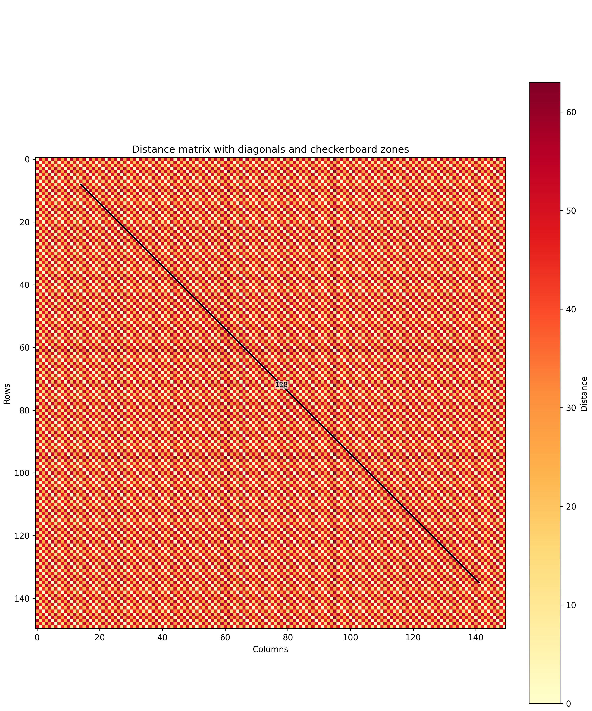

# CentHORD: Centromere Higher Order Repeat Detector

CentHORD is a tool for the detection of dimeric or generic Higher Order repeats (HOR)  in alpha satellite regions (centromeres).

## Steps of the script


**0. Distance calculation**

Distance file can be generated with `distance_matrix_full_blocks.py`.
The script computes dense distance matrices for sequences grouped by contig.
If the number of sequences in a contig exceeds a threshold, split them into
overlapping blocks of size L (block_length) with a step size S (step_size).
Each block is saved as a full dense matrix in its own HDF5 file.

Input should be a fasta file with all individual monomers. 
Title lines should include: sequence name, contig name and the position along the contig.

```
./distance_matrix_full_blocks.py -i test_DC.fst  -\
                                 -o "" \
                                 -t 200 \
                                 -l 200 \
                                 -s 200 # non-overlapping blocks

```


Note: if monomers are searched with `get_monomers.py`, the title lines can be reformated with:

```
awk '$1 ~ ">" {print $1, $1} $1 !~ ">" {print $0}' test.fst.monomer_seq_1.fst |\
      sed 's/>>/>/'         |\
      sed 's/>>//'          |\
      sed 's/\(.*\)_/\1 /'      >  test.fst.monomer_seq_1.fst2

``` 


If needed, HDF5 files can be converted to TXT files:

```
./convert_h5py_to_txt.py  -i test_DC.h5 -o test_DC.txt

```


**1. Distance loading**

Input can be a plain text file or an HDF5 file (--input_type).
The file must contain a square distance matrix.

Note:matrix file can be generated with `distance_matrix_full_blocks.py`

**2. Diagonal detection – generic HOR detection (enabled with --detect_diagonals)**

 - Local convolution to detect diagonals

Small diagonals are detected using a convolution filter applied along 
matrix diagonals (--conv_size, default=5).
For each point in the score matrix, the local mean (or median) and the 
local variability (standard deviation or MAD) are computed for each 
position. With the option "--local_method" set to "robust" the program will used median+MAD.
The size of local environment can be adjusted (--local_size, default=5) and the 
score at each position is compared to the expected score from the background level.
diagonales with a score X time above the standard deviation are 
considered as significant (--sd_factor, default=2).
Then, significant small diagonals that overlap are merged to form longer 
diagonals.


 - Optional neighbor merging

Nearby long diagonals can be merged (--merge_diagonals). 
Two thresholds (--merge_mode, default="fixed") are implemented to define "nearby" diagonales:
- diagonals separated by less than N monomers (--merge_gap "fixed", default=5)
- diagonals separated by less than N % of the shorter diagonal (--merge_gap "relative") 
The diagonals are saved into a CSV file.


**3. Filtering & selection**

Non-overlapping longest diagonals are selected and saved into a CSV file.
The main diagonal and diagonals with negative indices are excluded.
On the heatmap, only the lengths of the selected non-overlapping diagonals are labeled, at their centers (not on the main diagonal).

TODO: so far, overlaps are search on the y axis. Should be search on y and x axes simultaneously.

**4. Checkerboard detection – dimeric HOR detection (enabled with --detect_checkerboard)**

Local NCC-based search (CHECKER_SIZE)

A checkerboard kernel is slided only along the main diagonal (or a band defined by --checker_band).
At each position, a normalized cross-correlation (NCC) score is computed.
Hits are retained if their score exceeds --checker_ncc_threshold.

Small overlapping checkerboard hits are merged into larger regions.
Large checkerboard regions are written to a CSV file.


**6. Plot**

On the heatmap with distances is generated. 
Large diagonals and large cherckerboards are shown. 
An additional barplot above the heatmap shows the NCC score profile, aligned to sequence positions.


## Versions

9. version 9:
   - heatmap can be plot with relative (default) or fixed color scale. In this later case, the users have to fix the minimal and maximal values
   - the program calculate the mean distance in the background of each diagonal. 
    Two  values are calculated: with vs. without (background only) the diagonal 
10. version 10:
   - heatmaps are squares
   - empty CSV file is created (headers are written) even if no diagonal is detected
   - image definition can be changed (`--dpi` option)
   - for diagonals, CSV files include mean/median/variance distances for 
   diagonals and mean/median distances for neighbors (defined as X 
   monomers around the diagonals, X can be changed with the option 
   `--neighbor_distance`)
11. version 11:
  - Multiphred allowed
  - Batch mode taking as input a dir of multiple h5 files.
12. version 12:
  - Non-overlapping diagonals corrected
  - Output TSV changed, some cols were added or deleted.
  - Combined_tsv argument allows to have results from all block in 3 tsv files (checkerboard, diagonals and non-overlapping diagonals)
  - peel mod is now default
   
## Examples


### For generic HOR (diagonales)

```
./CentHORD__9.py --input test/test_DC.h5 \
                 --input_type h5 \
                 --detect_diagonals \
                 --conv_size 11 \
                 --local_method robust \
                 --local_size 11 \
                 --sd_factor 2 \
                 --merge_diagonals \
                 --merge_gap 0 \
                 --prewhiten_checker 0
```


### For dimeric HOR (checkboard)

```
./CentHORD__9.py --input test/test_DC.h5 \
                 --input_type h5 \
                 --detect_checkerboard\
                 --checker_ncc_threshold 0.1
```
### For both

```
./CentHORD__9.py --input test/test_DC.h5 \
                 --input_type h5 \
                 --detect_diagonals \
                 --conv_size 11 \
                 --local_method robust \
                 --local_size 11 \
                 --sd_factor 2 \
                 --merge_diagonals \
                 --merge_gap 0 \
                 --prewhiten_checker 0 \
                 --detect_checkerboard\
                 --checker_ncc_threshold 0.1
```

### Output




