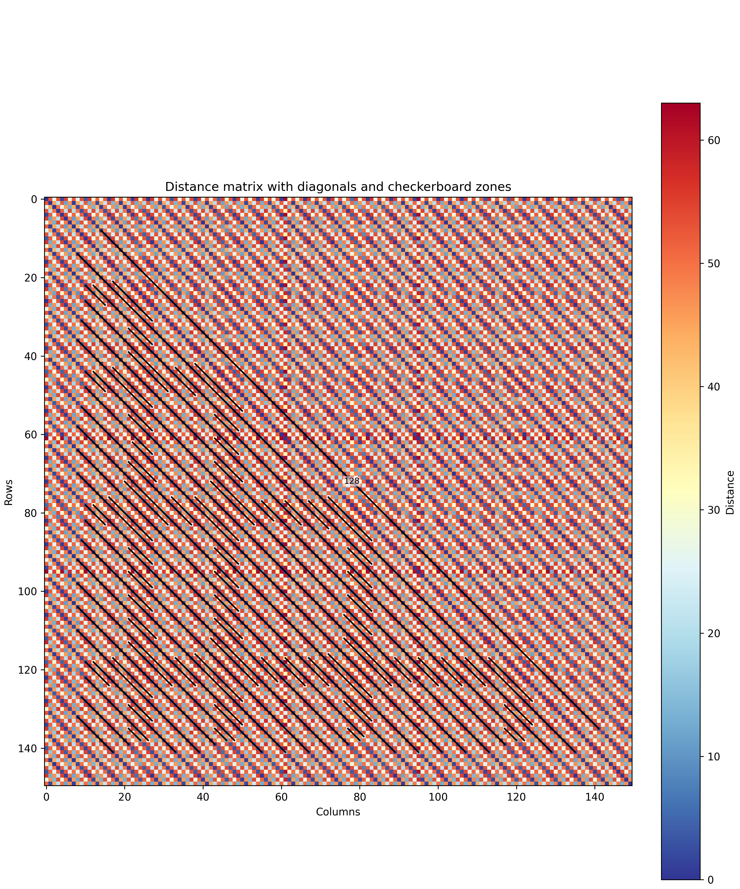

# CentHORD

CentHORD: Centromere Higher Order Repeat Detector


CentHORD is a tool for the detection of dimeric or generic Higher Order repeats (HOR)  in alpha satellite regions (centromeres).

## Steps of the script

1. Load the distance matrix

Input can be a plain text file or an HDF5 file (--input_type).
The file must contain a square distance matrix.

Note:matrix file can be generated with `distance_matrix_full_blocks.py`

2. Diagonal detection – generic HOR detection (enabled with --detect_diagonals)

 1. Local convolution to detect diagonals

Small diagonals are detected using a convolution filter applied along 
matrix diagonals (--conv_size).
For each point in the score matrix, the local mean (or median) and the 
local variability (standard deviation or MAD) are computed for each 
position.
The size of local environment can be adjusted (--local_size) and the 
score at each position is compared to the expected score from the background level.
diagonales with a score X time above the standard deviation are 
considered as significant (--sd_factor).
Then, significant small diagonals that overlap are merged to form longer 
diagonals.


2. Optional neighbor merging

Nearby long diagonals can be merged (--merge_diagonals). 
Two thresholds (--merge_mode) are implemented to define "nearby" diagonales:
- diagonals separated by less than N monomers (--merge_gap)
- diagonals separated by less than N % of the shorter diagonal (--merge_gap again) 
The diagonals are saved into a CSV file.


3. Filtering & selection

Non-overlapping longest diagonals are selected and saved into a CSV file.
The main diagonal and diagonals with negative indices are excluded.
On the heatmap, only the lengths of the selected non-overlapping diagonals are labeled, at their centers (not on the main diagonal).

TODO: so far, overlaps are search on the y axis. Should be search on y and x axes simultaneously.

4. Checkerboard detection – dimeric HOR detection (enabled with --detect_checkerboard)

Local NCC-based search (CHECKER_SIZE)

A checkerboard kernel is slided only along the main diagonal (or a band defined by --checker_band).
At each position, a normalized cross-correlation (NCC) score is computed.
Hits are retained if their score exceeds --checker_ncc_threshold.

5. Merging small checkerboards

Small overlapping checkerboard hits are merged into larger regions.
Large checkerboard regions are written to a CSV file.


6. Plot

On the heatmap with distances is generated. 
Large diagonals and large cherckerboards are shown. 
An additional barplot above the heatmap shows the NCC score profile, aligned to sequence positions.

## Examples


### for generic HOR (diagonales)

```
./CentHORD__7.py --input test/test_DC.h5 \
                 --input_type h5 \
                 --detect_diagonals \
                 --conv_size 11 \
                 --local_method robust \
                 --local_size 11 \
                 --sd_factor 2 \
                 --merge_diagonals \
                 --merge_gap 0 \
                 --prewhiten_checker 0
```



### for dimeric HOR (checkboard)


## Installation


## Test


## Syntaxe


